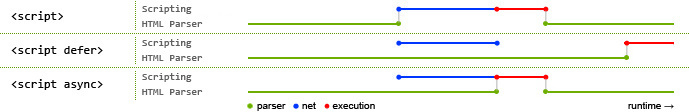

##重新复习回顾js高级程序设计  

> 感觉还是基础不够扎实所以看完书都整理下写出来  
  
  * js包含DOM(文档对象模型)，BOM(浏览器对象模型)，EM三部分，其中DOM对象不仅是js有，他有自己的API
  * 老生长谈，html中可以通过script和style内嵌入js和css代码，也可以通过 script标签和link标签外联js文件和css文件。
  * 其中script外联js文件，可以是不同域的js文件，img标签也可以外联不同域的图片文件。这也是为什么script标签和img标签能实现跨域的原因。但是要注意，script外联的跨域文件，最好保证是自己维护的，因为一旦别人修改了该js文件，你引用的同样也改了。  
  * 区别html和xhtml，xhtml相比html更加严格，必须标签闭合等，网上一大堆，不再细说。  
  * 在xhtml中使用< 或 >时都会被当作标签解析，所以写小于号时你需要写成 &lt，但是很难辨认，因此可以在xhtml中js使用CData片段来做‘hack’。
  * 文档模式共有三种：混杂模式、标准模式和准标准模式，其中标准模式和准标准模式差别很小，一般说的标准模式也指准标准模式。文档模式通过文档类型
  来切换。文档类型就是html文件最顶部的‘doctype’。严格类型的文档类型对应标准模式，过度和框架型的文档类型对应准标准模式，文档类型有关键字提示。  
  * 第二章我觉得最重要的是script的标签位置这个小节。  

##script标签  
script标签你可以放在html的head，body标签中。但是放的位置不同，影响也不同。浏览器在构建dom树的时候，css文件和img是异步的，但是js是会
阻止dom树的构建的，结果就是js引擎先解析运行js，js完事后才继续构建dom树。    

结果：script外联的文件放在head中，可能会导致浏览器打开网页时空白现象。所以一般把js文件放在“</body>”之前。  
但是有两个神器帮助我们改变这些情况：defer和async。  
defer是延迟的意思，即使script放在head中，但是使用了defer这个属性，也不会影响dom树的构建。因为js文件被延迟到dom树碰到“</html>”标签才加载运行。如果有两个js外联文件都使用了defer，他们是按顺序执行的，并且先于DOMContentLoaded事件（html5）   

async是异步的意思，script外联文件使用了async这个属性，js文件和html解析异步进行，互不等待。两个外联文件都使用了async，不一定按顺序执行，所以代码不要互相依赖。async代码一定会在load事件前执行。    

建议：js外联文件还是放在“</body>”之前。
借用一张图来说明：  

  
  
蓝色线代表网络读取，红色线代表执行时间，都针对脚本；绿色线代表 HTML 解析。  
  
  如果想了解浏览器解析和渲染过程，可以看看webkit技术内幕这本书